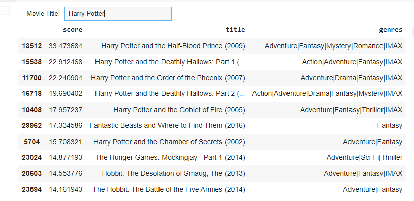

# Movie-Recommendation_System
Movie Recommendation System using Collaborative Filtering in Python

# Steps:
1. Open the Movie_Recommendation.ipynb in Jupyter Notebook or Google Colab.
2. Make sure to download the dataset from https://files.grouplens.org/datasets/movielens/ml-25m.zip and upload the required CSV files (movies.csv, links.csv, ratings.csv) before running the code.

# Note:
1. The dataset is not up-to-date so new movies might be not available.

# Output:

